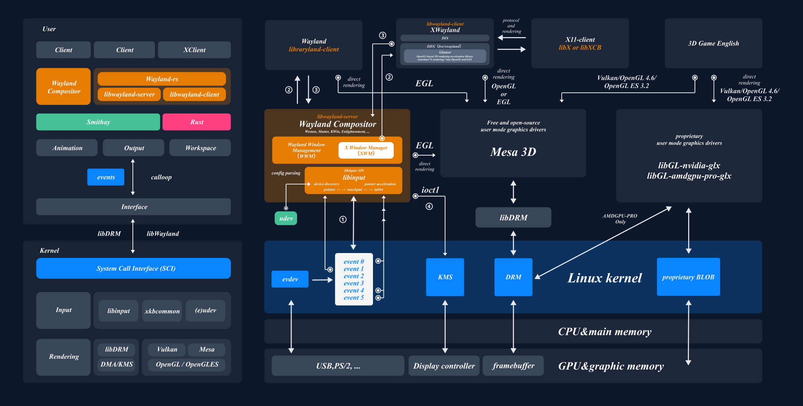
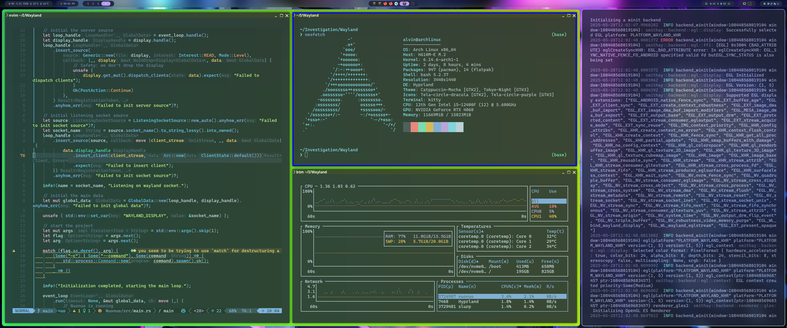
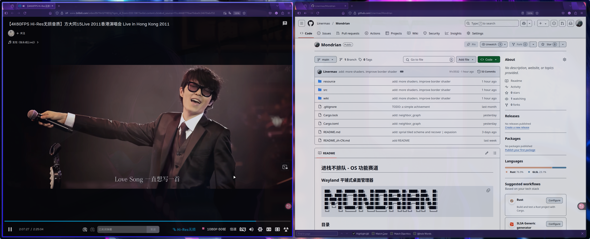

## 进栈不排队 - proj340 - Wayland 平铺式桌面管理器

---

```
███╗   ███╗ ██████╗ ███╗   ██╗██████╗ ██████╗ ██╗ █████╗ ███╗   ██╗
████╗ ████║██╔═══██╗████╗  ██║██╔══██╗██╔══██╗██║██╔══██╗████╗  ██║
██╔████╔██║██║   ██║██╔██╗ ██║██║  ██║██████╔╝██║███████║██╔██╗ ██║
██║╚██╔╝██║██║   ██║██║╚██╗██║██║  ██║██╔══██╗██║██╔══██║██║╚██╗██║
██║ ╚═╝ ██║╚██████╔╝██║ ╚████║██████╔╝██║  ██║██║██║  ██║██║ ╚████║
╚═╝     ╚═╝ ╚═════╝ ╚═╝  ╚═══╝╚═════╝ ╚═╝  ╚═╝╚═╝╚═╝  ╚═╝╚═╝  ╚═══╝
```

### 目录

- [进栈不排队 - proj340 - Wayland 平铺式桌面管理器](#进栈不排队---proj340---wayland-平铺式桌面管理器)
  - [目录](#目录)
  - [基本信息](#基本信息)
  - [项目简介](#项目简介)
  - [项目演示](#项目演示)
  - [项目运行](#项目运行)
  - [项目结构](#项目结构)
  - [项目进度](#项目进度)
- [性能分析](#性能分析)
- [参考文件](#参考文件)
- [贡献者](#贡献者)

### 基本信息

- 比赛类型：OS功能赛道：模块实验创新赛道
- 学校名称：杭州电子科技大学
- 队伍编号：T202510336995660
- 队伍名称：进栈不排队
- 队伍成员：
  - 林灿
  - 吴悦怡
  - 陈序
- 指导老师：周旭，王俊美

### 项目简介

> 本项目的详细技术文档目录在 wiki 中，其中包含了详细的模块设计，解释，测试评估等内容。

本项目基于 [Smithay](https://github.com/Smithay/smithay.git) 使用 Rust 开发了一个使用 Wayland 协议的平铺式桌面显示系统。项目能够在裸机终端中自行初始化 DRM/KMS 图形管线，并通过 GBM 和 EGL 建立 GPU 渲染上下文，使用 OpenGLES 进行硬件加速合成显示。启动后该 Compositor 接管系统图形输出，并成为客户端程序（如终端模拟器、浏览器）的 Wayland 显示服务。

ppt与视频链接：[https://www.alipan.com/s/3TTTscPaeHB](https://www.alipan.com/s/3TTTscPaeHB)
提取码: i60e




- **设计哲学**
  
  > “Beauty is the promise of happiness.” — Stendhal
  
  - 本项目秉持 **“优雅即力量”** 的设计哲学，力求在系统结构与用户体验之间取得和谐平衡。无论是内部代码逻辑还是外部交互呈现，都追求简洁、清晰而富有韵律的表达。

- **代码体量**
  
  - 累计修改超 **20,000** 行代码，新增 **10,000+** 行，配套文档逾 **20,000** 字，涵盖架构设计、接口协议与开发细节。

- **全栈实现**
  
  - 实现双后端架构：`winit` 支持桌面环境，`tty` 支持裸机直启，图形界面无需登录管理器，直接运行于 GPU 设备之上。

- **数据结构与算法**
  
  - 引入改造后的 ***容器式二叉树布局方案***，实现灵活的平铺与窗口变换；结合 `SlotMap` 实现节点的 **常数时间** 复杂度插入、删除与查找，极大提升动态性能。

- **开箱即用，可编程式定制**

  - 适配大部分 linux 发行版，部署操作简单，提供默认桌面模板，同时支持通过配置文件与自定义 Shell 脚本进行深度定制。

- **动画与渲染**
  
  - 自定义过渡动画与渲染逻辑，配合手写 `GLSL` shader，实现流畅、响应式的交互体验，视觉层次统一且精致。

### 项目演示







### 项目运行

Wayland 基础协议配置：

```bash
# archlinux
sudo pacman -S --needed wayland

# ubuntu must use 25.05 or above, don't need any operations

# extra
# fcitx5 输入法安装
sudo pacman -S fcitx5-im fcitx5-chinese-addons fcitx5-rime

# kitty 终端安装
sudo pacman -S kitty
```

项目运行：

```bash
# 获取源代码
git clone https://github.com/Linermao/Mondrian.git

cd /Mondrian

# 初始化配置文件
cargo build

# 直接执行
cargo run

# 导出可执行文件
cargo build --release
```

### 项目结构

```
📦 项目结构
├── 📁 src                  # Rust 源代码目录
│   ├── backend/                # 后端初始化与设备管理
│   ├── config/                 # 键盘快捷键与其他配置文件
│   ├── input/                  # 输入监听相关模块
│   ├── layout/                 # 布局模块
│   ├── manager/                # 二级模块管理
│   ├── protocol/               # Wayland 协议实现模块
│   ├── render/                 # 渲染相关模块
│   ├── utils/                  # 工具函数
│   ├── state.rs                # 全局状态结构体定义
│   └── main.rs                 # 程序入口
├── 📁 resource             # 外部资源文件，如图标、字体等
├── 📁 wiki                 # 技术文档与开发记录
├── 📄 Cargo.toml           # Rust 配置文件，包含依赖与元信息
├── 📄 README.md            # 项目英文说明
└── 📄 README_zh-CN.md      # 项目中文说明与竞赛背景
```

### 项目进度

#### 🗿 里程碑事件

| 日期        | 功能实现                                                 |
| --------- | ---------------------------------------------------- |
| 2025.3.25 | 基础 `compositor` 开发，实现 `client` 与 `compositor` 的简单通信。 |
| 2025.3.29 | 输入设备交互逻辑实现完成。                                        |
| 2025.4.16 | 优化布局算法，使用 `slotmap` 实现高效动态平铺。                        |
| 2025.5.20 | 完成 `tty` 裸机模式下的直连启动             |
| 2025.6.6 | 实现窗口动画效果            |
| 2025.6.19 | 完成 `layer-shell` 协议    |


#### 🎯 项目启动与协议实现

- [x] 实现 `winit` 后端启动

- [x] 实现 `tty` 后端启动

- [ ] 实现无 `GPU` 渲染（基于 CPU software rendering）

- [x] 实现 `xdg_shell` 基本协议支持

- [x] 实现 `layer_shell` 基本协议支持

- [ ] 实现 `xwayland` 基本协议支持

#### 🧩 输入设备管理

- [x] 实现鼠标，键盘的监听与管理

- [x] 实现键盘快捷键响应

- [x] 实现 keybindings.conf 自定义键盘快捷键

- [x] 实现使用键盘控制窗口的移动与布局

- [ ] 实现使用鼠标进行窗口的移动与缩放

- [ ] 实现拓展设备的输入监听 - 触摸板，手写板，VR设备等

- [ ] 实现多套输入设备的处理机制，避免冲突

#### 🪟 窗口与布局管理

- [x] 实现基本的平铺式布局（跟随鼠标 focus）
  
  - [x] 实现 **二叉容器树** 数据结构，实现插入，删除基本窗口操作
  
  - [x] 实现 全局邻接表 数据结构，实现对邻居窗口的方向感知

- [ ] 实现多种平铺算法的热切换与自定义调整
  
  - [x] 动态平铺算法（NeighborGraph）
  
  - [x] 添加 Spiral 布局方案
  
  - [ ] 切换与自定义机制

- [ ] 实现多显示器（output）的输出逻辑
  
  - [x] 自动发现输出设备
  
  - [ ] 独立管理每个 output 的 layout / workspace

- [ ] 优化工作区（workspace）的切换逻辑
  
  - [x] 每个 output 绑定一个默认 workspace
  
  - [ ] 跨 output 的 window 移动逻辑

- [ ] 实现 tiled 与 floating 窗口的互换与共存

- [ ] 优化 popups 管理逻辑，允许其成为 floating 窗口

#### 🎨 美化效果

- [x] 实现动画效果（窗口动画 / 过渡效果）

- [x] 实现更好的 focus 边框效果（呼吸状态 / 颜色渐变）

- [x] 实现 swww 壁纸设置

- [x] 实现 waybar 状态栏设置

#### 🧠 状态与记忆功能

- [ ] 实现软件组布局记忆功能
  
  - [ ] 支持软件 ID 分组（如 terminal + browser）
  
  - [ ] 保存并恢复各窗口位置、大小、浮动状态

#### 🧭 性能测试与优化

- [x] 使用 tracing 进行事件信息追踪

- [x] 使用 tracing 进行事件耗时追踪

- [ ] 实现 GPU 渲染优化

## 性能分析


使用 weston-simple-egl 进行帧率测试，能够稳定达到 100帧（显示器帧率）

## 参考文件

- [https://github.com/Smithay/smithay](https://github.com/Smithay/smithay)
- [https://github.com/YaLTeR/niri](https://github.com/YaLTeR/niri)
- [https://docs.rs/smithay](https://docs.rs/smithay)
- [https://wayland-book.com/](https://wayland-book.com/)
- [https://wayland.freedesktop.org/docs/html/](https://wayland.freedesktop.org/docs/html/)
- [https://en.wikipedia.org/wiki/Windowing_system](https://en.wikipedia.org/wiki/Windowing_system)
- [https://wayland.app/protocols/](https://wayland.app/protocols/)
- [https://support.touchgfx.com/docs/basic-concepts/framebuffer](https://support.touchgfx.com/docs/basic-concepts/framebuffer)

## 贡献者

- 林灿：[Linermao](https://github.com/Linermao)